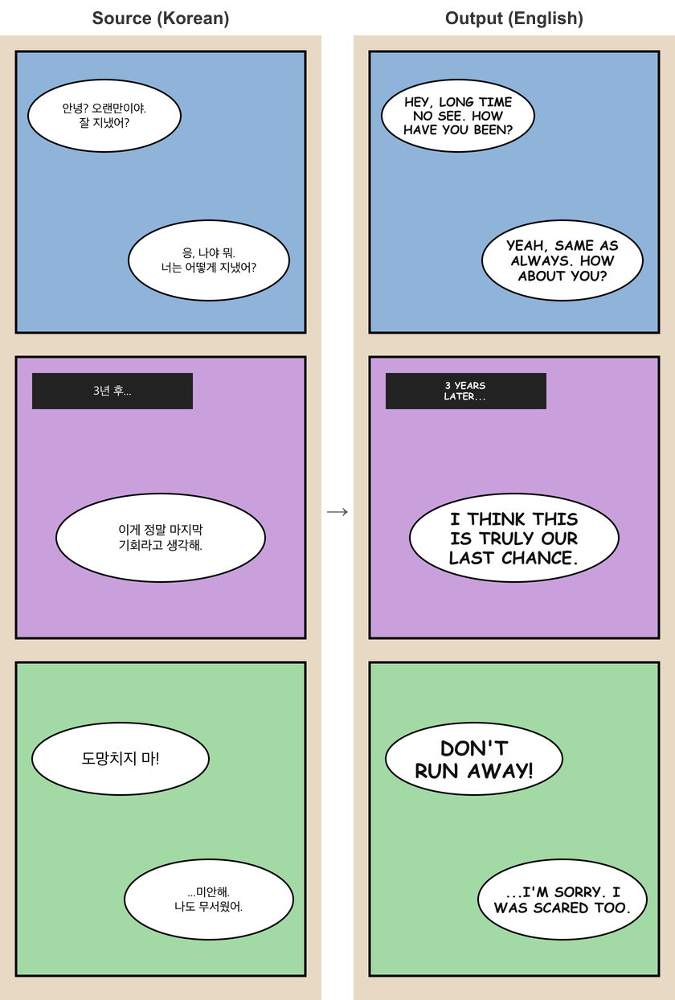

# webtoon-translator

Translate webtoon / manhwa / manga pages into English, end to end: find the text, read and translate it with an LLM, erase the original, and typeset the English back into the bubbles.

<p align="center">
  
  <br>
  <sub><code>node bin/cli.js samples/strip.png --lang ko</code> — the bundled synthetic sample, untouched output.</sub>
</p>

```
node bin/cli.js page.jpg --lang ko        →  out/page.en.png
```

| Step | What runs | Notes |
|---|---|---|
| **Detect** | [RT-DETR-v2 comic detector](https://huggingface.co/ogkalu/comic-text-and-bubble-detector) (ONNX, CPU) | Trained on ~11k manga / webtoon / western comic pages. Returns speech bubbles *and* text boxes. Tall strips are scanned in square sliding windows. |
| **OCR + translate** | **OpenAI**, **Gemini**, or **Gemini on Vertex AI** — your choice | One batched call per page: a page thumbnail for context plus one crop per text box. Returns original, translation, speaker and role. |
| **Erase** | [LaMa fine-tuned for manga/anime](https://github.com/Sanster/models/releases/tag/AnimeMangaInpainting) (TorchScript; Apple MPS / CUDA / CPU) | Stroke-level masks, so artwork under watermarks and free text survives and panel borders don't get "continued" through bubbles. |
| **Typeset** | opentype.js vector text | Real glyph metrics, shrink-to-fit, centred on the bubble's actual interior (flood-filled from the erased text), dark/light text chosen from the background, outlined text over art, symbol font fallback. |

Roughly 15 s for a 720×9000 strip on an M-series Mac, using one or two LLM calls.

### As a service

`python py/scrub.py serve` keeps the detector and LaMa loaded and answers JSON-line jobs on
stdin; `src/scrub-py.js` runs a pool of these (`SCRUB_WORKERS`, default cores/3, each
`SCRUB_THREADS` ONNX threads) so batch translation never pays model load per page and
never oversubscribes the CPU. Measured on a 12-core M-series: one page ~6 s, ten pages
at once ~16 s. The mangally app's `scripts/translate-server.mjs` is the HTTP front for it.

## Setup

Requires Node ≥ 20, Python ≥ 3.12 and [uv](https://docs.astral.sh/uv/).

```bash
git clone https://github.com/surya758/webtoon-translator
cd webtoon-translator
npm install
npm run setup:py       # creates py/.venv with torch, onnxruntime, opencv
npm run models         # downloads detector.onnx + anime-manga-big-lama.pt (~385 MB)
cp .env.example .env   # then set ONE of the credential options below
```

### Choose an LLM backend

The backend is auto-detected from whichever credential you set; override with `--provider` / `LLM_PROVIDER`.

| Provider | Set | Default model |
|---|---|---|
| `openai` | `OPENAI_API_KEY` | `gpt-5-mini` (`OPENAI_MODEL` / `--model`) |
| `gemini` | `GEMINI_API_KEY` (AI Studio key) | `gemini-3.5-flash-lite` (`GEMINI_MODEL`) |
| `vertex` | `service-account.json` in the repo root, or `GOOGLE_APPLICATION_CREDENTIALS_JSON`, or `GOOGLE_CLOUD_PROJECT` + ADC | `gemini-3.5-flash-lite` (`GEMINI_MODEL`) |

Any OpenAI-compatible gateway works via `OPENAI_BASE_URL`.

## Usage

```bash
node bin/cli.js page.jpg                          # auto-detect language + provider
node bin/cli.js page.jpg --lang es                # source-language hint (ko, ja, zh, es, …)
node bin/cli.js page.jpg --provider openai -m gpt-4.1-mini
node bin/cli.js page.jpg --series myshow.json     # series memory: glossary, character voices, recent pages (see below)
node bin/cli.js page.jpg --glossary names.txt     # one-off list of names / terms to keep consistent
node bin/cli.js page.jpg --review                 # QA pass: model inspects the typeset page, overflow/unreadable
                                                  # blocks are re-rendered smaller, clear mistranslations fixed
node bin/cli.js page.jpg --json --keep            # dump regions JSON + keep out/.work (mask, scrubbed page)
node bin/cli.js --help
```

Try it on the bundled synthetic sample: `node bin/cli.js samples/strip.png --lang ko`.

### Series memory (`--series`)

Pages of a serial are translated in isolation unless you tell the tool they belong together. `--series myshow.json` keeps a small localization bible per series and uses it on every page:

- **glossary** — proper nouns, titles, techniques, catchphrases and the English chosen for each; the prompt tells the model to use these renderings exactly.
- **characters** — each speaker with pronouns and a short voice description ("blunt, swears", "formal, addresses everyone as sir"), so a character sounds the same on page 40 as on page 3.
- **recent** — the last 6 pages' dialogue, so conversations continue naturally across page breaks.

The file is created if missing, read before translating, and after each page a cheap text-only call proposes additions, which are merged in. Edit it by hand any time; add `"locked": true` to an entry the model must never change.

### Cache

Detection, translation and inpainting results are cached under `~/.cache/webtoon-translator` (`CACHE_DIR` / `--cache dir` / `--no-cache`), keyed by image content plus whatever each stage depends on. Re-running a page with a different model, prompt, font or series context only redoes the stage whose inputs changed — a re-render is under a second, a re-translate skips detection and LaMa entirely.

## How the pipeline makes its decisions

1. **Detect** (`py/scrub.py detect`) — class-agnostic NMS across the detector's two text classes, nested-box suppression, and each text box is paired with the bubble that contains it.
2. **Translate** (`src/translate.js`) — the LLM sees the whole page (downscaled) and every crop; it labels each as `dialogue / thought / caption / sfx / sign / credit`. Detections that come back with no text are dropped here, so the detector's false positives (window grids, patterns) are never erased.
3. **Erase** (`py/scrub.py inpaint`) — only boxes with confirmed text are masked. Bubble text: dilated letter strokes. Text over art: colour-aware stroke mask (catches translucent watermarks). LaMa runs per connected component on a padded crop. `credit` (scanlation watermarks, site URLs) is erased and not re-rendered; `sign` (shop names, plates, title logos), anything that translates to itself, and — for non-Latin source languages — anything already in Latin script (brand names, English on clothing) is left exactly as drawn.
4. **Render** (`src/render.js`) — font size is capped near the original's (estimated from box area ÷ character count). The block is centred on the centroid of the bubble's interior, found by flood-filling the fill colour from the erased text's spot (eroded so gaps between burst lines don't leak; bounded locally so each lobe of a multi-lobe bubble is handled on its own). Fewer lines are preferred when that costs under ~18 % of size. The model also tags each line's lettering (`bold` / `italic` / `shout`): bold and shouts get a heavier face (shouts up to +20 % size), italics are slanted.
5. **Review** (`src/review.js`, `--review`) — crops of every typeset block from the *finished* page go back to the model; anything flagged as overflowing or unreadable is re-rendered at 85 %, and a flagged mistranslation with a suggested fix is swapped in. One extra call per page.

## Customising

- **Font** — `FONT_PATH=/path/to/font.ttf` (defaults: Comic Sans MS Bold on macOS, DejaVu Sans Bold on Linux). Use a real comic face like *CC Wild Words* or *Anime Ace* for published-looking results. `FALLBACK_FONT_PATH` covers symbols the comic font lacks.
- **Detector sensitivity** — `--threshold` in `py/scrub.py` (default 0.3; safe to keep low since OCR filters false positives).
- **Prompt / tone** — `PROMPT` in `src/translate.js`.

## Known limits

- Brush-lettered sound effects drawn as artwork are often missed by the detector and left in the source language.
- One font family; emphasis is synthesised (stroke / skew) rather than true bold/italic faces. No vertical text.
- `sign` text is never translated (conservative on purpose — flip `b.role !== "sign"` in `src/pipeline.js` if you want shop signs localised).
- No correction UI yet; `--json --keep` exposes everything needed to build one.

## Credits

- Detector: [ogkalu/comic-text-and-bubble-detector](https://huggingface.co/ogkalu/comic-text-and-bubble-detector) (Apache-2.0), as used by [comic-translate](https://github.com/ogkalu2/comic-translate)
- Inpainting: [anime-manga-big-lama](https://github.com/Sanster/models/releases/tag/AnimeMangaInpainting) — LaMa ([Suvorov et al., WACV 2022](https://github.com/advimman/lama)) fine-tuned by the lama-cleaner author
- Prior art that shaped the design: [manga-image-translator](https://github.com/zyddnys/manga-image-translator), [BallonsTranslator](https://github.com/dmMaze/BallonsTranslator)

## Legal

This is a tool. Translating comics you don't hold rights to, and distributing the results, may infringe copyright in your jurisdiction. Use it on your own work, with permission, or for personal reading.

MIT — see [LICENSE](LICENSE).
